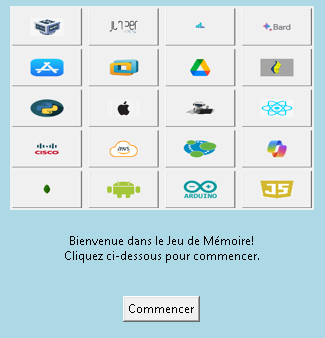

# Jeu de Mémoire - Technologies Informatiques

## Aperçu du Jeu
Le Jeu de Mémoire - Technologies Informatiques est un jeu éducatif développé en Python et utilisant la bibliothèque Tkinter. Ce jeu a pour objectif d'initier les utilisateurs aux concepts et aux technologies informatiques de manière ludique et interactive. Les joueurs doivent trouver des paires de cartes correspondantes, chaque paire représentant des éléments liés au domaine informatique, tels que les langages de programmation, la sécurité cloud et l'intelligence artificielle.

## Fonctionnalités Principales
- Trois niveaux de difficulté : Débutant, Avancé, Expert.
- Modes de jeu : Solo ou Multijoueur.
- Possibilité de personnaliser les noms des joueurs en mode multijoueur.
- Suivi du nombre de tentatives justes et fausses.
- Affichage des scores en mode multijoueur.
- Chronomètre pour mesurer le temps écoulé en mode solo.
- Tableau de podium pour les résultats finaux.

## Captures d'écran

## Outils et Langages Utilisés pour le Développement
Ce jeu a été développé en utilisant les technologies suivantes :
- Python
- Tkinter (pour l'interface utilisateur)
- PIL (Pillow) (pour la manipulation d'images)

## Comment Jouer
1. Sélectionnez un niveau de difficulté et un mode de jeu (Solo ou Multijoueur).
2. Si vous jouez en mode Multijoueur, personnalisez les noms des joueurs.
3. Cliquez sur "Commencer le jeu".
4. Retournez les cartes pour trouver des paires correspondantes.
5. En mode Multijoueur, collectez des points en trouvant des paires correspondantes.
6. Terminez le jeu en trouvant toutes les paires ou en atteignant un certain nombre de points.

---

Pour jouer au jeu, téléchargez le code source et exécutez-le localement. Nous espérons que vous apprécierez ce jeu éducatif sur les technologies informatiques !
